# Reto Tecnico - Gestion de Productos

Proyecto dividido en tres capas para gestionar productos:

- **Oracle Database:** tabla `PRODUCTO`, restricciones y package `PKG_PRODUCTO` con procedimientos CRUD.
- **Backend Java 8:** API REST con Spring Boot, Spring Data JPA, Bean Validation y Oracle.
- **Frontend Angular 17:** interfaz web para listar, filtrar, crear, editar, visualizar y eliminar productos.

---

## Estructura del Proyecto

```text
RETO/
  1. ORACLE/
    01_DDL.sql
    02_PKG_PRODUCTO.sql
    03_DML_TEST.sql
  2. JAVA/
    reto/
  3. ANGULAR/
    front-reto/
```

---

# Parte 1: Oracle Database

## Descripcion General

La capa Oracle implementa la persistencia principal del sistema de productos. Incluye:

- Creacion de la tabla `PRODUCTO`.
- Restricciones de integridad para datos obligatorios, valores permitidos y valores no negativos.
- Indice compuesto para optimizar busquedas por `MARCA` y `MODELO`.
- Package `PKG_PRODUCTO` con procedimientos para crear, actualizar, eliminar logicamente, obtener por ID y listar productos.
- Script `03_DML_TEST.sql` con datos y flujos de prueba manuales.

## Archivos Incluidos

| Archivo | Descripcion |
|---------|-------------|
| `1. ORACLE/01_DDL.sql` | Crea la tabla `PRODUCTO`, constraints e indice. |
| `1. ORACLE/02_PKG_PRODUCTO.sql` | Crea el package `PKG_PRODUCTO` con procedimientos CRUD. |
| `1. ORACLE/03_DML_TEST.sql` | Inserta data inicial y ejecuta flujos de prueba del package. |

## Estructura de la Tabla PRODUCTO

| Columna | Tipo | Descripcion |
|---------|------|-------------|
| `ID_PRODUCTO` | `NUMBER(10)` | Identificador unico autogenerado. |
| `CODIGO` | `VARCHAR2(20)` | Codigo unico del producto. |
| `NOMBRE` | `VARCHAR2(120)` | Nombre del producto. |
| `MARCA` | `VARCHAR2(60)` | Marca del producto. |
| `MODELO` | `VARCHAR2(60)` | Modelo del producto. |
| `PRECIO` | `NUMBER(10,2)` | Precio del producto. |
| `STOCK` | `NUMBER(10)` | Stock disponible. |
| `ESTADO` | `CHAR(1)` | `A` activo, `I` inactivo. |
| `FECHA_CREACION` | `TIMESTAMP` | Fecha automatica de creacion. |
| `FECHA_MODIF` | `TIMESTAMP` | Fecha de ultima modificacion. |

## Restricciones Implementadas

- `PK`: `ID_PRODUCTO`.
- `UK_PRODUCTO_CODIGO`: codigo unico.
- `CHK_PRODUCTO_PRECIO`: `PRECIO >= 0`.
- `CHK_PRODUCTO_STOCK`: `STOCK >= 0`.
- `CHK_PRODUCTO_ESTADO`: solo permite `A` o `I`.
- `IDX_PRODUCTO_MARCA_MODELO`: indice para filtros por marca y modelo.

## Package PKG_PRODUCTO

| Procedimiento | Funcion | Validaciones principales |
|---------------|---------|--------------------------|
| `SP_CREAR_PRODUCTO` | Inserta un producto nuevo. | Codigo unico activo, precio no negativo, stock no negativo. |
| `SP_ACTUALIZAR_PRODUCTO` | Actualiza datos de un producto activo. | Producto existente, codigo no duplicado, precio y stock validos. |
| `SP_ELIMINAR_LOGICO_PRODUCTO` | Cambia `ESTADO` a `I`. | Producto existente y activo. |
| `SP_OBTENER_PRODUCTO_ID` | Retorna un producto activo por ID. | Solo devuelve registros activos. |
| `SP_LISTAR_PRODUCTOS` | Lista productos activos con filtros opcionales. | Filtro por `MARCA`, `MODELO` o ambos. |

Todos los procedimientos retornan `p_error_cod` y `p_error_msg` para identificar si el flujo termino correctamente o si hubo un error de negocio/sistema.

## Ejecucion Oracle

1. Ejecutar `1. ORACLE/01_DDL.sql`.
2. Ejecutar `1. ORACLE/02_PKG_PRODUCTO.sql`.
3. Activar salida de consola si se usa SQL Developer: `SET SERVEROUTPUT ON`.
4. Ejecutar `1. ORACLE/03_DML_TEST.sql`.
5. Validar resultados en la tabla `PRODUCTO` y en los mensajes de `DBMS_OUTPUT`.

## Pruebas y Validaciones Oracle
| Flujo probado | Como se probo | Resultado esperado | Captura |
|---------------|---------------|--------------------|------------------|
| Creacion de tabla | Ejecucion de `01_DDL.sql`. | Tabla `PRODUCTO` creada con constraints e indice. | 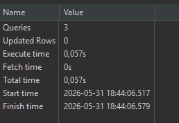 |
| Visualizacion de estructura | Consulta de la estructura. | Se observan campos de la tabla. |  |
| Creacion del package y SP | Ejecucion de `02_PKG_PRODUCTO.sql`. | Package `PKG_PRODUCTO` y sus SP creados correctamente. | 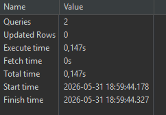 |
| Insercion de data inicial | Inserts de `03_DML_TEST.sql`. | Productos `PROD-001` a `PROD-005` creados. | 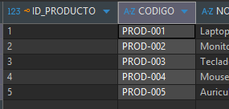 |
| Crear producto | `SP_CREAR_PRODUCTO` con `PROD-006`. | `p_error_cod = 0` y mensaje de creado con ID. | 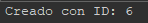 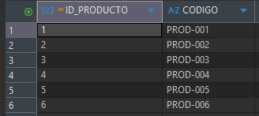 |
| Actualizar producto | `SP_ACTUALIZAR_PRODUCTO` sobre ID existente. | Datos actualizados y `FECHA_MODIF` registrada. | 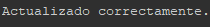 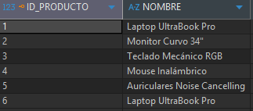 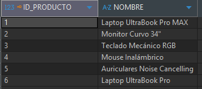|
| Eliminar logico | `SP_ELIMINAR_LOGICO_PRODUCTO`. | `ESTADO = 'I'`, sin eliminar fisicamente el registro. |  |
| Obtener por ID | `SP_OBTENER_PRODUCTO_ID`. | Retorna solo producto activo encontrado. | 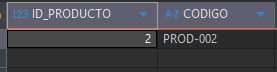 |
| Listar sin filtros | `SP_LISTAR_PRODUCTOS(NULL, NULL, ...)`. | Lista productos activos. | 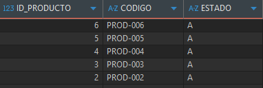 |
| Filtrar por marca | `SP_LISTAR_PRODUCTOS('Dell', NULL, ...)`. | Retorna coincidencias por marca. | 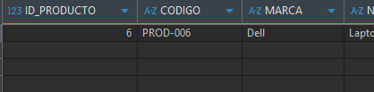 |
| Filtrar por modelo | `SP_LISTAR_PRODUCTOS(NULL, 'WH', ...)`. | Retorna coincidencias por modelo. | 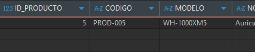 |
| Filtrar por marca y modelo | `SP_LISTAR_PRODUCTOS('Logitech', 'MX', ...)`. | Retorna coincidencias combinadas. | 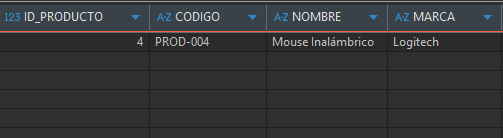 |
| Validar codigo duplicado | Intentar crear/actualizar con codigo activo existente. | `p_error_cod = -1` y mensaje de codigo en uso. | 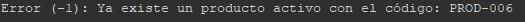 |
| Validar precio negativo | Intentar crear/actualizar con `p_precio < 0`. | `p_error_cod = -1` y mensaje de precio invalido. |  |
| Validar stock negativo | Intentar crear/actualizar con `p_stock < 0`. | `p_error_cod = -1` y mensaje de stock invalido. | 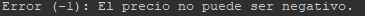 |
|
Imagen ya agregada:

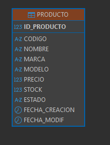

---

# Parte 2: Backend Java 8

API REST construida con Java 8, Spring Boot 2.7.17, Spring Web, Spring Data JPA, Bean Validation, Lombok y Oracle Database.

## Requisitos

- Java 8 o superior para compilar el proyecto configurado con target Java 8.
- Maven.
- Oracle Database disponible en `localhost:1521/FREEPDB1`.
- Usuario Oracle: `MIAPP`.
- Password Oracle: `root123`.

## Configuracion

La aplicacion principal usa Oracle en `2. JAVA/reto/src/main/resources/application.yaml`:

```yaml
spring:
  application:
    name: reto
  datasource:
    url: jdbc:oracle:thin:@//localhost:1521/FREEPDB1
    username: MIAPP
    password: root123
    driver-class-name: oracle.jdbc.OracleDriver
  jpa:
    database-platform: org.hibernate.dialect.Oracle12cDialect
    hibernate:
      ddl-auto: update
```

Los tests usan H2 en memoria desde `2. JAVA/reto/src/test/resources/application.yaml`, por lo que no dependen de Oracle para ejecutarse.

## Ejecutar Backend

Desde `2. JAVA/reto/`:

```bash
mvn spring-boot:run
```

La API queda disponible en:

```text
http://localhost:8080
```

## Ejecutar Pruebas Unitarias/Integracion Ligera

Desde `2. JAVA/reto/`:

```bash
mvn test
```

Captura actual:

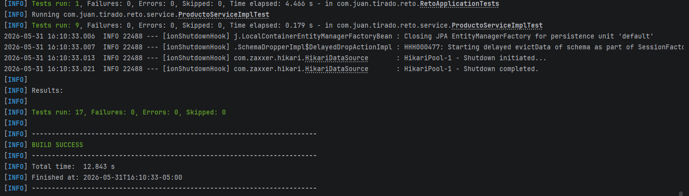

Ruta sugerida si se actualiza la captura: `docs/img/java/00_mvn_test.png`.

## Validaciones Backend

| Campo | Validacion | Respuesta esperada si falla |
|-------|------------|-----------------------------|
| `codigo` | Obligatorio y maximo 20 caracteres. | `400 Bad Request`. |
| `nombre` | Obligatorio y maximo 120 caracteres. | `400 Bad Request`. |
| `marca` | Obligatoria y maximo 60 caracteres. | `400 Bad Request`. |
| `modelo` | Obligatorio y maximo 60 caracteres. | `400 Bad Request`. |
| `precio` | Obligatorio, no negativo, maximo 8 enteros y 2 decimales. | `400 Bad Request`. |
| `stock` | Obligatorio y no negativo. | `400 Bad Request`. |
| `codigo` duplicado | No puede repetirse entre productos activos. | `409 Conflict`. |
| `id` inexistente/inactivo | No se puede consultar, editar o eliminar. | `404 Not Found`. |

## Pruebas Automatizadas Backend

| Clase | Flujo cubierto |
|-------|----------------|
| `RetoApplicationTests` | Carga del contexto de Spring Boot. |
| `ProductoControllerTest` | Endpoints REST, status HTTP, body invalido, producto no encontrado y eliminacion. |
| `ProductoServiceImplTest` | Reglas de negocio, normalizacion de texto, filtros, paginacion, codigo unico y eliminacion logica. |

Detalle de flujos cubiertos:

- Creacion de producto con respuesta `201 Created`.
- Validacion de body invalido con respuesta `400 Bad Request`.
- Listado paginado con filtros `marca` y `modelo`.
- Consulta por ID con respuesta `200 OK`.
- Consulta por ID inexistente con respuesta `404 Not Found`.
- Actualizacion de producto con respuesta `200 OK`.
- Eliminacion logica con respuesta `204 No Content`.
- Validacion de codigo duplicado con excepcion de conflicto.
- Normalizacion de valores de entrada usando `trim` y codigo en mayusculas.
- Conversion de filtros vacios a `null`.

## Endpoints y Pruebas Manuales Backend

Base URL:

```text
http://localhost:8080
```

### 1. Crear Producto

```bash
curl --location 'http://localhost:8080/api/productos' \
--header 'Content-Type: application/json' \
--data '{
  "codigo": "PROD001",
  "nombre": "Laptop Lenovo ThinkPad",
  "marca": "Lenovo",
  "modelo": "T14",
  "precio": 3499.90,
  "stock": 10
}'
```

Resultado esperado: `201 Created`.

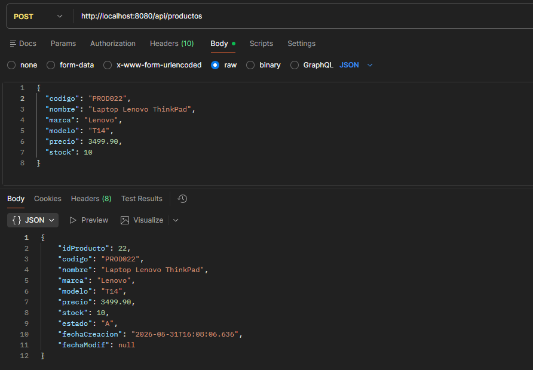

### 2. Listar Productos

```bash
curl --location 'http://localhost:8080/api/productos'
```

Resultado esperado: `200 OK`.

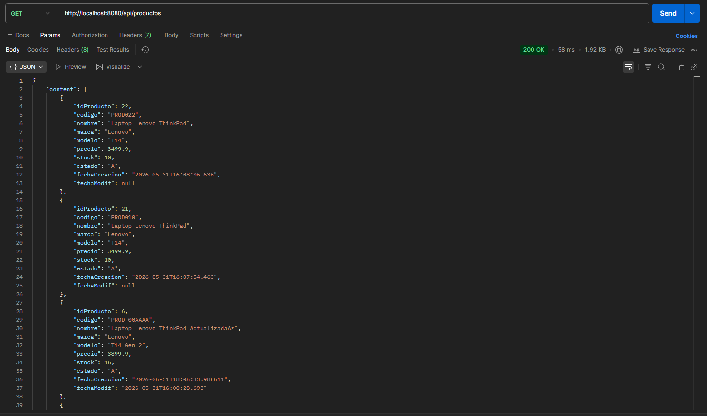

### 3. Listar con Paginacion

```bash
curl --location 'http://localhost:8080/api/productos?page=0&size=10'
```

Resultado esperado: `200 OK`.

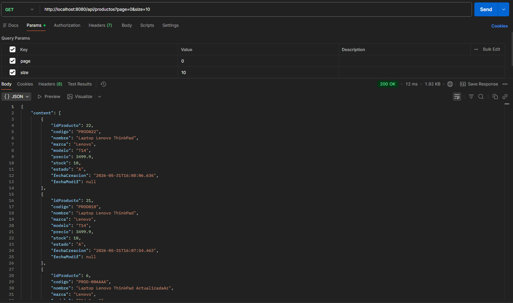

### 4. Filtrar por Marca

```bash
curl --location 'http://localhost:8080/api/productos?marca=Lenovo&page=0&size=10'
```

Resultado esperado: `200 OK`.

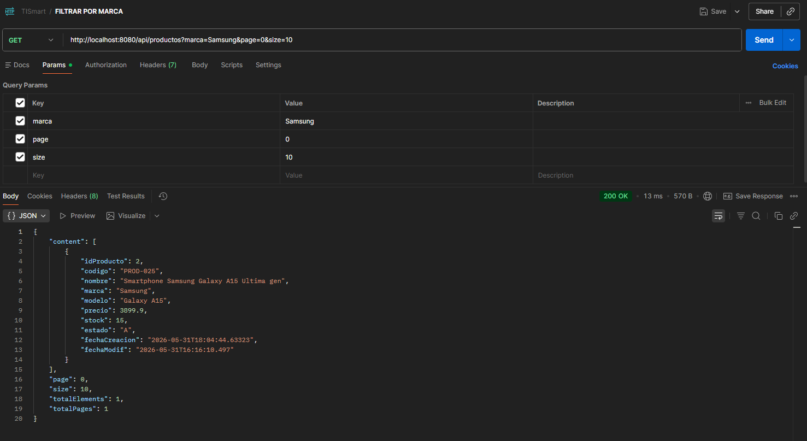

### 5. Filtrar por Modelo

```bash
curl --location 'http://localhost:8080/api/productos?modelo=T14&page=0&size=10'
```

Resultado esperado: `200 OK`.

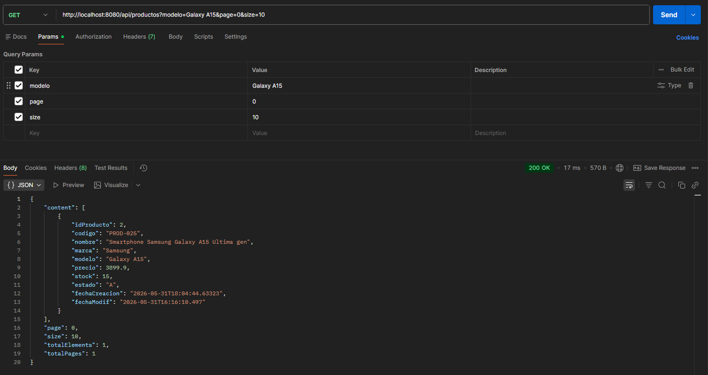

### 6. Filtrar por Marca y Modelo

```bash
curl --location 'http://localhost:8080/api/productos?marca=Lenovo&modelo=T14&page=0&size=10'
```

Resultado esperado: `200 OK`.

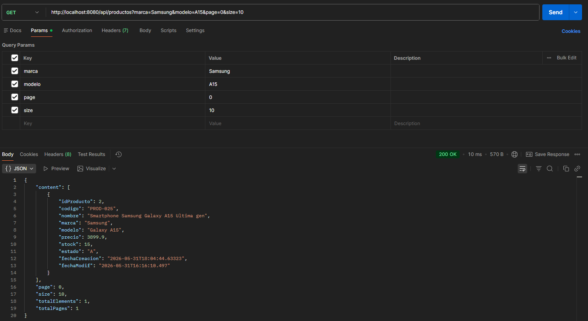

### 7. Obtener Producto por ID

```bash
curl --location 'http://localhost:8080/api/productos/1'
```

Resultado esperado: `200 OK` si existe y esta activo. Si no existe: `404 Not Found`.

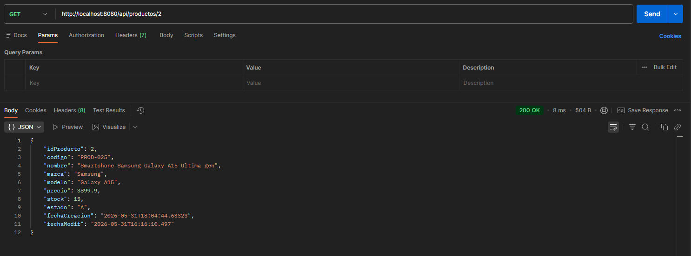

### 8. Actualizar Producto

```bash
curl --location --request PUT 'http://localhost:8080/api/productos/1' \
--header 'Content-Type: application/json' \
--data '{
  "codigo": "PROD001",
  "nombre": "Laptop Lenovo ThinkPad Actualizada",
  "marca": "Lenovo",
  "modelo": "T14 Gen 2",
  "precio": 3899.90,
  "stock": 15
}'
```

Resultado esperado: `200 OK`.

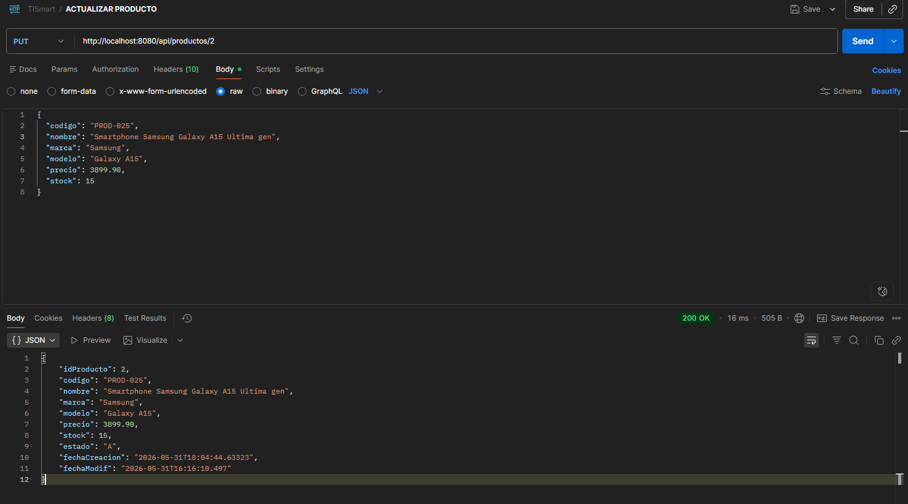

### 9. Eliminar Producto

```bash
curl --location --request DELETE 'http://localhost:8080/api/productos/1'
```

Resultado esperado: `204 No Content`.

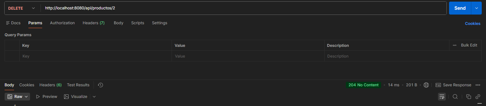

La eliminacion es logica: el producto se marca con estado `I`.

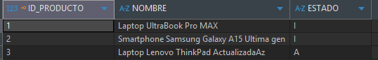

## Pruebas Manuales de Errores Backend

| Flujo probado | Como probarlo | Resultado esperado | Captura sugerida |
|---------------|---------------|--------------------|------------------|
| Body invalido | Enviar `codigo` vacio o sin campos obligatorios. | `400 Bad Request` con mensaje de validacion. | `docs/img/java/10_error_body_invalido.png` |
| Precio negativo | Enviar `precio: -1`. | `400 Bad Request`. | `docs/img/java/11_error_precio_negativo.png` |
| Stock negativo | Enviar `stock: -1`. | `400 Bad Request`. | `docs/img/java/12_error_stock_negativo.png` |
| Codigo duplicado | Crear otro producto activo con el mismo `codigo`. | `409 Conflict`. | `docs/img/java/13_error_codigo_duplicado.png` |
| Producto inexistente | Consultar `GET /api/productos/99999`. | `404 Not Found`. | `docs/img/java/14_error_producto_no_encontrado.png` |
| Editar inexistente | Enviar `PUT /api/productos/99999`. | `404 Not Found`. | `docs/img/java/15_error_actualizar_no_encontrado.png` |
| Eliminar inexistente | Enviar `DELETE /api/productos/99999`. | `404 Not Found`. | `docs/img/java/16_error_eliminar_no_encontrado.png` |

Estructura general de errores:

```json
{
  "timestamp": "2026-05-31T15:00:00",
  "status": 400,
  "error": "Bad Request",
  "mensaje": "Detalle del error"
}
```

Codigos principales:

- `400 Bad Request`: validaciones de entrada o argumentos invalidos.
- `404 Not Found`: producto no encontrado o inactivo.
- `409 Conflict`: codigo duplicado en un producto activo.
- `500 Internal Server Error`: error no controlado.

---

# Parte 3: Frontend Angular 17

Frontend web desarrollado con Angular 17 para la gestion de productos. La aplicacion permite consultar, filtrar, crear, editar, visualizar detalle y eliminar productos consumiendo la API REST.

## Caracteristicas

- Listado de productos en tabla con paginacion.
- Busqueda por marca y modelo.
- Registro de nuevos productos.
- Edicion de productos existentes.
- Visualizacion del detalle de un producto mediante dialogo.
- Eliminacion con dialogo de confirmacion.
- Validaciones de formulario para campos obligatorios, longitudes maximas y valores numericos no negativos.
- Notificaciones de resultado mediante `MatSnackBar`.

## Stack Tecnico

- Angular 17.
- Angular CLI.
- Angular Material.
- TypeScript.
- RxJS.
- SCSS.

## Estructura Principal

```text
src/app/
  components/
    confirm-dialog/
    product-detail/
    product-form/
    product-list/
  models/
    producto.model.ts
  services/
    producto.service.ts
  app.routes.ts
src/environments/
  environment.ts
```

## Rutas Frontend

| Ruta | Funcion |
|------|---------|
| `/productos` | Lista productos, permite filtrar, paginar, ver detalle, editar y eliminar. |
| `/productos/nuevo` | Formulario para registrar un producto. |
| `/productos/editar/:id` | Formulario para actualizar un producto existente. |

## API Backend Consumida

La URL base del backend se configura en `3. ANGULAR/front-reto/src/environments/environment.ts`:

```ts
export const environment = {
  production: false,
  apiUrl: 'http://localhost:8080/api'
};
```

El servicio `ProductoService` consume el recurso `/productos` y utiliza:

- `GET /productos`: lista productos con paginacion y filtros opcionales por `marca` y `modelo`.
- `GET /productos/{id}`: obtiene un producto por identificador.
- `POST /productos`: crea un producto.
- `PUT /productos/{id}`: actualiza un producto.
- `DELETE /productos/{id}`: elimina un producto logicamente.

## Requisitos Frontend

- Node.js compatible con Angular 17.
- npm.
- Backend disponible en `http://localhost:8080/api` o la URL configurada en `environment.ts`.

## Instalacion Frontend

Desde `3. ANGULAR/front-reto/`:

```bash
npm install
```

## Ejecucion en Desarrollo

Desde `3. ANGULAR/front-reto/`:

```bash
npm start
```

Luego abrir:

```text
http://localhost:4200/
```

## Build Frontend

Desde `3. ANGULAR/front-reto/`:

```bash
npm run build
```

Los artefactos se generan en:

```text
dist/front-reto/
```

## Pruebas y Validaciones Frontend

Estas pruebas son funcionales/manuales del sistema, no necesariamente pruebas unitarias.

| Flujo probado | Pasos | Resultado esperado | Captura sugerida |
|---------------|-------|--------------------|------------------|
| Carga inicial del listado | Abrir `http://localhost:4200/productos`. | Se muestra tabla con productos activos y paginador. | `docs/img/angular/01_listado_productos.png` |
| Spinner de carga | Recargar listado o navegar al formulario de edicion. | Se muestra indicador de carga mientras responde el backend. | `docs/img/angular/02_spinner_carga.png` |
| Filtro por marca | Ingresar marca y presionar `Buscar`. | Tabla muestra productos filtrados por marca. | `docs/img/angular/03_filtro_marca.png` |
| Filtro por modelo | Ingresar modelo y presionar `Buscar`. | Tabla muestra productos filtrados por modelo. | `docs/img/angular/04_filtro_modelo.png` |
| Filtro combinado | Ingresar marca y modelo. | Tabla muestra coincidencias por ambos filtros. | `docs/img/angular/05_filtro_marca_modelo.png` |
| Limpiar filtros | Presionar `Limpiar`. | Filtros quedan vacios y se recarga listado completo. | `docs/img/angular/06_limpiar_filtros.png` |
| Paginacion | Cambiar pagina o tamanio de pagina. | Se consultan nuevos resultados respetando `page` y `size`. | `docs/img/angular/07_paginacion.png` |
| Ver detalle | Presionar icono de visualizacion. | Se abre dialogo con datos del producto. | `docs/img/angular/08_detalle_producto.png` |
| Crear producto | Entrar a `Nuevo Producto`, completar campos validos y guardar. | Se crea producto, aparece snackbar y vuelve al listado. | `docs/img/angular/09_crear_producto.png` |
| Editar producto | Presionar editar, cambiar datos y guardar. | Se actualiza producto, aparece snackbar y vuelve al listado. | `docs/img/angular/10_editar_producto.png` |
| Confirmar eliminacion | Presionar eliminar y confirmar. | Se elimina logicamente, aparece snackbar y se recarga tabla. | `docs/img/angular/11_eliminar_producto.png` |
| Cancelar eliminacion | Presionar eliminar y cancelar/cerrar dialogo. | No se elimina el producto. | `docs/img/angular/12_cancelar_eliminacion.png` |
| Sin resultados | Buscar una marca/modelo inexistente. | Tabla muestra `No se encontraron productos`. | `docs/img/angular/13_sin_resultados.png` |
| Error del backend | Apagar backend y recargar listado. | Se muestra snackbar `Error al cargar productos`. | `docs/img/angular/14_error_backend.png` |

## Validaciones del Formulario Angular

| Campo | Validacion en frontend | Resultado esperado | Captura sugerida |
|-------|------------------------|--------------------|------------------|
| `codigo` | Obligatorio y maximo 20 caracteres. | Mensaje `El codigo es obligatorio` o `Maximo 20 caracteres`. | `docs/img/angular/15_validacion_codigo.png` |
| `nombre` | Obligatorio y maximo 120 caracteres. | Mensaje de obligatoriedad o longitud maxima. | `docs/img/angular/16_validacion_nombre.png` |
| `marca` | Obligatoria y maximo 60 caracteres. | Mensaje `La marca es obligatoria`. | `docs/img/angular/17_validacion_marca.png` |
| `modelo` | Obligatorio y maximo 60 caracteres. | Mensaje `El modelo es obligatorio`. | `docs/img/angular/18_validacion_modelo.png` |
| `precio` | Obligatorio y minimo `0`. | Mensaje `El precio es obligatorio` o `El precio no puede ser negativo`. | `docs/img/angular/19_validacion_precio.png` |
| `stock` | Obligatorio y minimo `0`. | Mensaje `El stock es obligatorio` o `El stock no puede ser negativo`. | `docs/img/angular/20_validacion_stock.png` |
| Codigo duplicado | Enviar un codigo ya existente. | Snackbar con mensaje retornado por backend. | `docs/img/angular/21_validacion_codigo_duplicado.png` |

## Evidencia Recomendada de Capturas

Para documentar el flujo completo, tomar capturas en este orden:

1. Oracle: tabla creada, data inicial, package ejecutado, crear, actualizar, eliminar logico, listar y validaciones de negocio.
2. Backend: `mvn test`, cada endpoint exitoso en Postman/cURL y errores principales `400`, `404`, `409`.
3. Frontend: listado, filtros, paginacion, detalle, creacion, edicion, eliminacion y validaciones del formulario.

Rutas recomendadas:

```text
docs/img/oracle/   -> capturas de SQL Developer, tabla, package y procedimientos.
docs/img/java/     -> capturas de Maven, Postman/cURL y respuestas del backend.
docs/img/angular/  -> capturas de pantallas del navegador Angular.
```

## Notas Tecnicas

- El frontend usa componentes standalone.
- Las rutas Angular estan definidas en `src/app/app.routes.ts`.
- El cliente HTTP se configura en `src/app/app.config.ts` mediante `provideHttpClient()`.
- Los estilos globales se encuentran en `src/styles.scss`.
- La eliminacion es logica en todas las capas: el registro pasa a `ESTADO = 'I'` y deja de aparecer en consultas activas.
